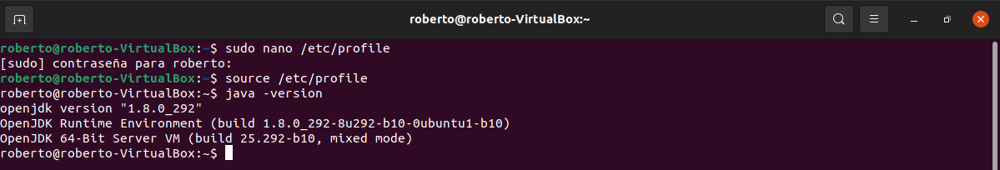

# Instalación de JDK en ubuntu.
Repositorio dedicado a la documentación de la instalación del jdk en Ubuntu.

## Instalar Java en Ubuntu desde repositorios.
1.  Primero hay que actualizar el sistema, para ello utilizados en siguiente comando:
```
  sudo apt-get update
```


2.	Una vez finalizado procedemos a la instalación de java usando el siguiente comando:
```
  sudo apt-get install default-jdk
```


3.	Procedemos a verificar que se realizado la instalación correctamente y comprobamos la versión de Java que tenemos instalada. Para ello utilizaremos el siguiente comando:
```
  java --version
```


## Instalación de una versión especifica de Java.
Ahora procederemos a realizar la instalación de una versión especifica de OpenJDK probaremos diferentes comandos para instalar varias versiones específicas, para ello se realizan las siguientes instrucciones: 
1.	Abrimos una terminal y probamos a introducir los siguientes comandos para instalar las versiones de OpenJDK:
   - 11 
   ```
   sudo apt install openjdk-11-jdk
   ```
   
   
  - 9
 
   ```
   sudo apt install openjdk-9-jdk
   ```
   
   
  - 8 
 
   ```
   sudo apt install openjdk-8-jdk  
  ```

   
   
2. Después de instalar la versión 8 comprobamos la versión instalada de Java, para ello utilizaremos el siguiente comando:

  ```
  java --version
  ```


Como no coincide con la versión 8 que es la que vamos a utilizar tenemos que configurar las variables de entorno.
## Configuración de las variables de entorno.
1.  Primero hay que comprobar las versiones listadas de OpenJDK para ello utilizamos el siguiente comando:
```
 ls /usr/lib/jvm
```


2.	Ahora hay que modificar el fichero profile, para editar y modificar dicho fichero utilizaremos el siguiente comando:
```
sudo nano /etc/profile
```

  Tenemos que insertar los siguientes parámetros al final del fichero:

```
# Java version
JAVA_HOME=/usr/lib/jvm/java-8-openJdk-amd64
PATH=$PATH:$HOME/bin:$JAVA_HOME/bin
export JAVA_HOME
export JRE_HOME
export PATH
```


3.  Después insertar las líneas anteriores guardamos el fichero y comprobamos la versión de java con el comando utilizado anteriormente, verificando que tenemos instalada la versión 8 del OpenJDK.


